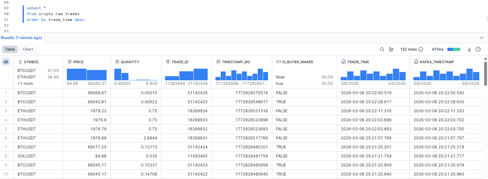
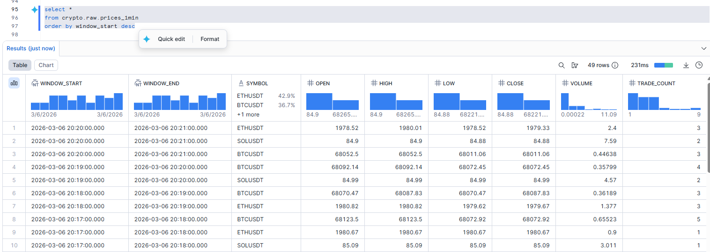
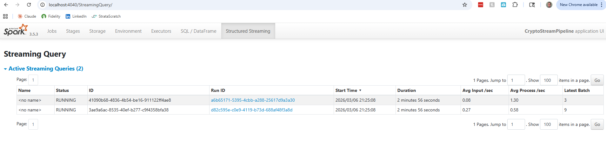

# Crypto Stream Pipeline

Real-time cryptocurrency trade streaming: Binance WebSocket → Kafka → Spark Structured Streaming → Snowflake.

Companion project to [tlc-pipeline](https://github.com/primalrun/tlc-pipeline) (batch). Together they demonstrate both batch and streaming patterns on the same stack.

For implementation details see [INTERNALS.md](INTERNALS.md).

---

## Architecture

```
Binance WebSocket API (BTCUSDT, ETHUSDT, SOLUSDT trade events)
      │
      ▼
Kafka Producer (Python)  ──►  topic: crypto_trades
      │
      ▼
Spark Structured Streaming
      ├──► CRYPTO.RAW.trades        (raw ticks,  trigger every 10s)
      └──► CRYPTO.RAW.prices_1min  (1-min OHLCV, trigger every 60s)
```

**No Airflow** — streaming is continuous, not batch-triggered.
**No S3** — data flows directly Kafka → Spark → Snowflake.

---

## Stack

| Layer | Technology |
|---|---|
| Ingest | Binance WebSocket combined stream (free, no auth) |
| Message broker | Apache Kafka 3.7 (KRaft mode, no Zookeeper) |
| Stream processing | Apache Spark 3.5.3 Structured Streaming |
| Sink | Snowflake (Spark connector `foreachBatch`) |
| Infrastructure | Terraform (Snowflake only) |
| Orchestration | Docker Compose |

---

## Snowflake Tables

**`CRYPTO.RAW.trades`** — raw tick data, appended every 10 seconds

| Column | Type |
|---|---|
| symbol | VARCHAR |
| price | FLOAT |
| quantity | FLOAT |
| trade_id | BIGINT |
| timestamp_ms | BIGINT |
| is_buyer_maker | BOOLEAN |
| trade_time | TIMESTAMP_NTZ |
| kafka_timestamp | TIMESTAMP_NTZ |

**`CRYPTO.RAW.prices_1min`** — 1-minute OHLCV aggregates, appended every 60 seconds

| Column | Type |
|---|---|
| window_start | TIMESTAMP_NTZ |
| window_end | TIMESTAMP_NTZ |
| symbol | VARCHAR |
| open | FLOAT |
| high | FLOAT |
| low | FLOAT |
| close | FLOAT |
| volume | FLOAT |
| trade_count | INTEGER |

Tables are created automatically by the Spark connector on first write.





---

## Prerequisites

- Docker + Docker Compose
- Terraform >= 1.5
- A Snowflake account (free trial works)

---

## Setup

### 1. Clone and configure

```bash
git clone https://github.com/primalrun/crypto-stream-pipeline
cd crypto-stream-pipeline

cp .env.example .env
# Edit .env with your Snowflake credentials
```

### 2. Provision Snowflake with Terraform

```bash
cd terraform
cp terraform.tfvars.example terraform.tfvars
# Edit terraform.tfvars with your Snowflake credentials

terraform init
terraform apply
cd ..
```

This creates: `CRYPTO` database, `RAW` schema, `CRYPTO_WH` warehouse, and `STREAM_ROLE`.

### 3. Build Docker images

```bash
make build
```

The Spark image downloads Kafka and Snowflake JARs from Maven Central at build time (~200 MB).

### 4. Start services

```bash
make up
```

Starts: Kafka (KRaft), kafka-init (topic creation), producer (Binance WebSocket), spark-master, spark-worker.

### 5. Start the streaming job

```bash
make stream
```

Runs `spark-submit` inside the spark-master container. Two streaming queries start concurrently. Press `Ctrl+C` to stop.

---

## Makefile Commands

| Command | Description |
|---|---|
| `make build` | Build all Docker images |
| `make up` | Start all services (background) |
| `make down` | Stop all services |
| `make restart` | Down + up |
| `make logs` | Follow all container logs |
| `make stream` | Start Spark streaming job (foreground) |
| `make kafka-ui` | Launch Kafka UI at http://localhost:8085 |

---

## Verification

After `make up` and `make stream`:

**Check producer is publishing:**
```bash
docker compose logs producer
# Should show: BTCUSDT  price=...  qty=...
```

**After ~30 seconds — raw trades in Snowflake:**
```sql
SELECT COUNT(*), symbol
FROM CRYPTO.RAW.trades
GROUP BY symbol;
```

**After ~2 minutes — OHLCV rows in Snowflake:**
```sql
SELECT *
FROM CRYPTO.RAW.prices_1min
ORDER BY window_start DESC
LIMIT 10;
```

---

## How It Works

### Producer (`producer/producer.py`)

Connects to the Binance combined WebSocket stream for BTCUSDT, ETHUSDT, SOLUSDT. Each trade event is serialized as JSON and published to the `crypto_trades` Kafka topic with the symbol as the message key. Reconnects automatically on disconnect.

### Spark Streaming (`spark/jobs/stream_prices.py`)

**Query 1 — Raw trades (10s trigger)**
Reads from Kafka, parses JSON, derives `trade_time` from `timestamp_ms` and `kafka_timestamp` from Kafka's own timestamp, then appends each micro-batch to `CRYPTO.RAW.trades` via `foreachBatch`.

**Query 2 — 1-min OHLCV (60s trigger)**
Same parsed stream, windowed by 1 minute on `trade_time` with a 2-minute watermark. Aggregates open/high/low/close (price) and volume (sum of quantity) per symbol. Uses `outputMode("append")` so finalized windows are written exactly once to `CRYPTO.RAW.prices_1min`.

### Kafka (KRaft mode)

Single-broker setup with 3 partitions on `crypto_trades` — one per symbol. KRaft mode eliminates the Zookeeper dependency.

### Spark Streaming UI

The Structured Streaming tab at **http://localhost:4040** shows both live queries with batch counts, processing rates, and watermark progress.



---

## Lessons Learned

Issues encountered during implementation and how they were resolved.

**`bitnami/kafka` removed from Docker Hub**
Bitnami migrated their images off Docker Hub. Switched to the official `apache/kafka:3.7.0` image. Configuration env vars use `KAFKA_*` prefix (not `KAFKA_CFG_*`) and scripts live at `/opt/kafka/bin/` instead of being on `$PATH`.

**Binance.com geo-blocked in the US (HTTP 451)**
`stream.binance.com` returns HTTP 451 ("Service unavailable from a restricted location") from US IPs. Switched the WebSocket URL to `stream.binance.us:9443`, which is the Binance US endpoint and accessible without restriction.

**Snowflake Spark connector JAR version doesn't exist**
`spark-snowflake_2.12:2.15.0-spark_3.5` returns 404 on Maven Central — the connector dropped the `-spark_3.x` version suffix starting at v3.0. The correct artifacts are `spark-snowflake_2.12:3.1.7` and `snowflake-jdbc:3.28.0`.

**`spark-submit` not found in `docker compose exec`**
The `apache/spark` image doesn't add `/opt/spark/bin` to `$PATH` for exec sessions. Fixed by using the full path `/opt/spark/bin/spark-submit` in the Makefile.

**Spark driver UI inaccessible from host**
Clicking an application link in the Spark master UI (port 8083) redirects to the driver UI on the container's internal Docker IP, which the host browser can't reach. Fixed by mapping port 4040 from spark-master to the host in `docker-compose.yaml`. The Structured Streaming tab at http://localhost:4040 then shows live query statistics.

---

## Project Structure

```
crypto-stream-pipeline/
├── producer/
│   ├── producer.py          # Binance WebSocket → Kafka
│   ├── requirements.txt
│   └── Dockerfile
├── spark/
│   └── jobs/
│       └── stream_prices.py # Spark Structured Streaming (two queries)
├── terraform/
│   ├── main.tf
│   ├── providers.tf
│   ├── variables.tf
│   ├── snowflake.tf         # DB, schema, warehouse, role, grants
│   ├── outputs.tf
│   └── terraform.tfvars.example
├── Dockerfile.spark         # apache/spark:3.5.3 + Kafka JARs + Snowflake JARs
├── docker-compose.yaml
├── .env.example
├── Makefile
└── README.md
```
